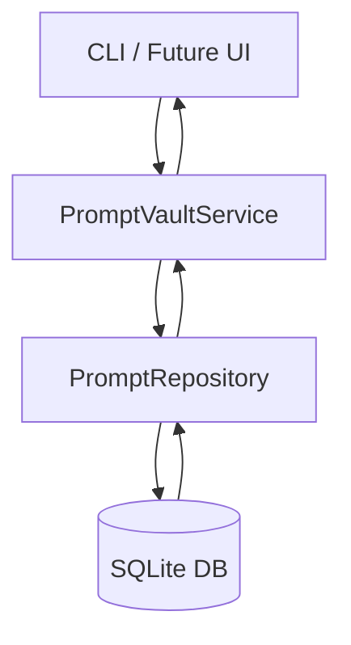

# Architecture Overview

Prompt Vault currently focuses on the domain and persistence layers that will power the eventual React + Tauri experience. The 
implementation follows a layered architecture designed for testability and future expansion.

## Component Layers

1. **Domain Layer (`src/domain/`)**
   - Defines TypeScript interfaces for `Prompt`, `PromptVersion`, and `Tag`.
   - Provides rich error types and validation schemas using Zod.
   - Contains no external side-effects, enabling reuse in frontend and backend contexts.

2. **Persistence Layer (`src/repositories/`)**
   - `PromptRepository` handles all interactions with SQLite via `better-sqlite3`.
   - Automatically executes migrations on initialization to ensure schema currency.
   - Encapsulates SQL statements, shielding higher layers from storage specifics.

3. **Service Layer (`src/services/`)**
   - `PromptVaultService` validates input, orchestrates repository calls, and shapes output models.
   - Aggregates errors and converts them into domain-specific exceptions.
   - Provides the API surface that both the CLI and future UI will consume.

4. **Interface Layer (`src/cli/`)**
   - Commander-based CLI offering `create`, `list`, `tag`, and `version` commands.
   - Produces human-friendly output with Chalk.
   - Serves as a stop-gap developer experience until the desktop UI is built.

## Data Flow

- Requests originate from the CLI (or eventual UI) and hit the service layer.
- The service layer validates input with Zod and coordinates repository operations.
- The repository performs SQL statements against SQLite, mapping rows back to domain models.
- Responses bubble back up with rich metadata (tags, latest version, etc.).

## Database Schema

Tables reside in `src/db/migrations/001_init.sql` and include:

- `prompts` – prompt metadata with slug uniqueness enforced.
- `prompt_versions` – semantic version, body, and changelog per revision.
- `tags` – descriptive labels shared across prompts.
- `prompt_tags` – join table linking prompts and tags.
- `prompt_latest_version` view – convenience view to fetch the newest version timestamp.

## Extensibility Notes

- Introduce additional migrations as numbered SQL files and build a small migration runner (planned for future step).
- Expose the service layer via HTTP (Express or Tauri backend) when building the desktop UI.
- Add analytics tables for usage telemetry once privacy requirements are defined.

This architecture balances simplicity with clarity, ensuring that each layer has a single responsibility and is fully testable.
